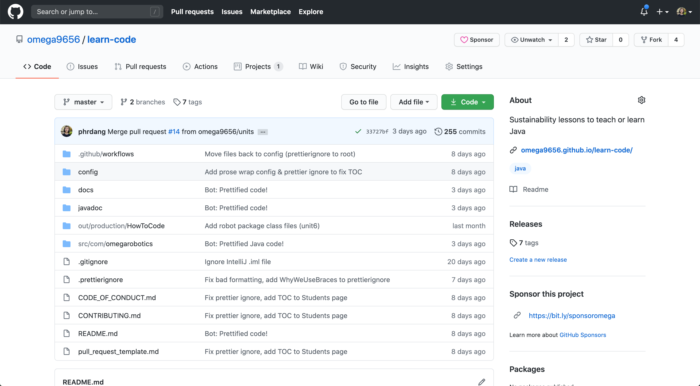
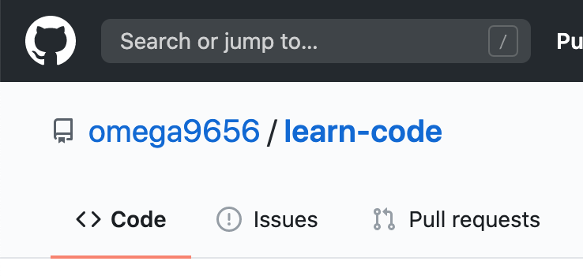
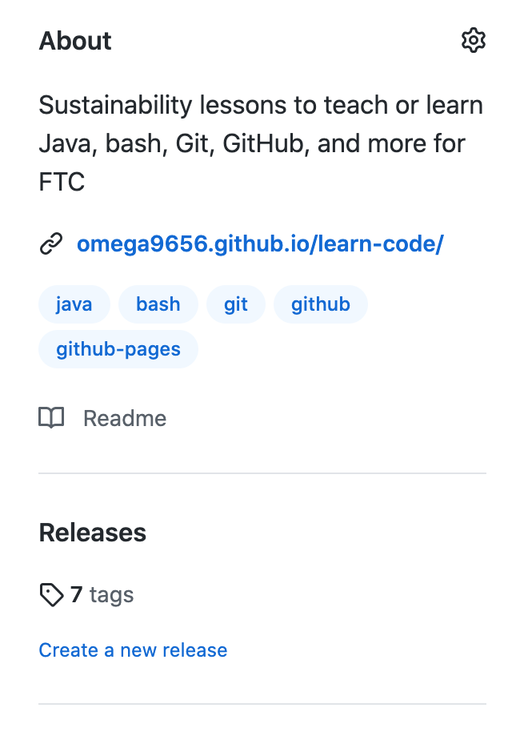
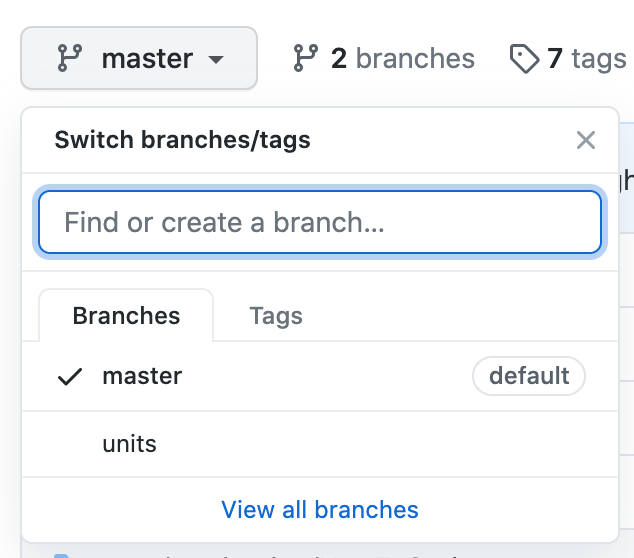
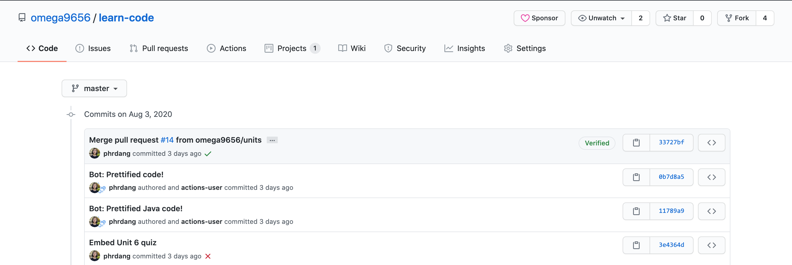
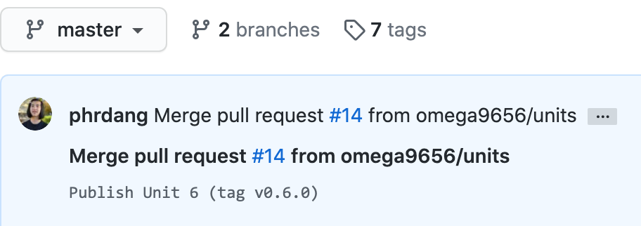
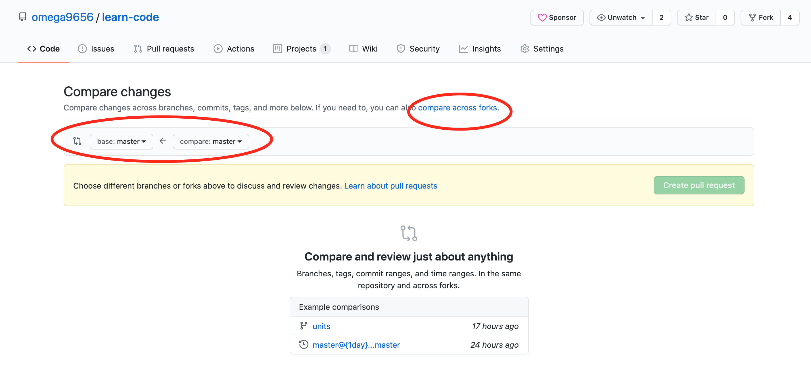
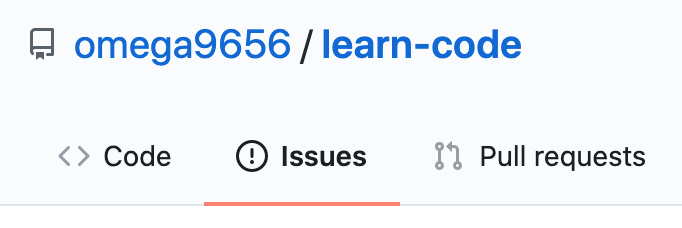

<!-- prettier-ignore-start -->

# Unit 7: Git - GitHub
{: .no_toc }

## Table of Contents
{: .no_toc .text-delta }

1. TOC
{:toc}

<!-- prettier-ignore-end -->

## GitHub

While Git is a version control system you use on your local device,
[GitHub](https://github.com) is a website that allows you to host
remote repositories. It also has cool features which makes collaboration
and sharing code easier on the Internet.

You can technically also use GitHub to edit files in your browser, but generally
developers will do that on a separate application since there are more
features like linting.

You can create an account [here](https://github.com/join).

## Repositories

Let's look at a repository on GitHub to learn some of the different features.

### Menus and Buttons

In the top right, we have the repository owner (omega9656) and name (learn-code).

In the top left, we have the sponsor button (if applicable), watch button, star button,
and [fork](#forking) button. Watch allows you to "follow" the repository. The star
allows you to save the repository to your starred repositories.

The menu right below the repo name allows you access different features built into
GitHub, such as [Issues](#issues) or [Pull Requests](#pull-requests). You can also
find the repo settings on the far right of the menu.

### Sidebar

On the right sidebar, you can do things like:

- Edit the repo's description, website link, and topics (basically like hashtags)
- View the Readme (by clicking on the link)
- View releases (see [`git tag`](/learn-code/learn/unit7/other-useful-stuff#git-tag))
- View contributors
- View languages that the repo is written in

### View Code

In the central area, you can browse through the repo's directories and view files.
You can also see the last commit message for that file/directory and how long ago
that commit occurred.

At the top of the file browser is the most recent commit message, its author, and its hash.

Notice also that on the top left you can switch branches and [tags](/learn-code/learn/unit7/other-useful-stuff#git-tag) and view all branches and tags.

To view commit history, click on the top right corner where it tells you the number
of commits made on this repo. It should look something like this:

Notice it displays the commit message and author on the left, and the commit hash on the right.
You can click on the clipboard icon next to the hash to copy it.

If you click on the commit message, you can view the files that were modified and how
they changed from the previous commit. If you click on the <> icon on the far right,
you can browse files at that point in time
(like [`git checkout`](/learn-code/learn/unit7/fixing-mistakes-time-traveling#git-checkout)).

**Note**: If a commit message has a message body (it's more than one line), click
on the 3 dots to view the entire message.

When viewing a file on GitHub, you can click on the pencil icon on the far right
to edit it in your browser. You can also delete the file by clicking on the trash icon.

### Readme

If you scroll down below the file browser, you can read the repository's
Readme file (if there is one). The Readme usually includes information about what
the repository is, how to use it, and how to contribute to it.

## Contributing

You have probably heard of open source software. GitHub has 2 main features
that help with this model of letting anyone contribute to software: forks and
pull requests. (They can also be used within a private team to protect the
`master` branch.)

### Forking

To understand what forking is, think about the phrase "a fork in the road."
That means that the road diverges. This is what happens when you _fork_
a repository - it's basically a more extreme version of branching.

To be more technical about forking, it is when you make a copy of
a repository under your own account. For example, the official Learn Code
repository is under the [@omega9656](https://github.com/omega9656) GitHub account, so the "long" name
for the repo is [omega9656/learn-code](https://github.com/omega9656/learn-code).

However, since the repository is public for anyone to view on GitHub,
they can create a fork of the repository. For example, [@phrdang](https://github.com/phrdang)
has forked the repository, so the "long" name for _that_ repo is
[phrdang/learn-code](https://github.com/phrdang/learn-code).

To differentiate the different branches on the forks, we use the `username:branch`
notation. For example, as of August 6, 2020 1:33 PM PST, `omega9656:master` is even with `phrdang:master`.

The reason why forks exist is to allow people who are not collaborators
on the original project to push code without messing with "official" branches.
(Technically you can still use forks if you're inside of the project team,
but it's more common for collaborators to simply have different branches that reside
in the original remote repository.)

#### How to Fork

To fork a repository on GitHub, go to the repository and click on the Fork button
in the top right corner.

### Pull Requests

Now that we have a fork, what do we do once we're satisfied that our changes
are ready to be implemented in the "official" repository? We can submit
a _pull request_ (PR) to ask the "official" repository collaborators to pull
changes from your branch (or fork) into a branch of the "official" repository (typically `master`).

Remember that you can make PRs as an outsider (through merging a forked branch into a branch
from the original repo) or as an inside collaborator on the repo (through merging a branch
into `master`).

#### Create a PR

To create a pull request, go to the repository on GitHub, click on the **Pull requests** tab,
and click on the green **New pull request** button.

At this point, GitHub will ask you which branch you want to pull from and onto what branch
you want to merge those pulled changes. The `base:` branch is the destination and the `compare:`
branch is the branch you want to pull changes from.

You can also compare changes across forks by clicking on the link circled in red. If you do this,
be sure to specify the base repository (repo you are merging into) and the head repository (repo you are pulling from).

Note that you can only create a PR if there is a difference between the two branches
you're comparing. Otherwise, there's no point!

Once you've chosen the right branches/repos to compare, you can view differences between files
and then click the green **Create pull request** button to create a PR. You will need to give
your PR a descriptive title and description. Many repos will have PR templates that you should
fill out accordingly. They may also have contributing guidelines or a code of conduct that you
should read and follow before submitting the PR.

#### After Submission

Once you submit the PR, you will be brought to the PR's unique page. The URL of this page is
the repository URL with `/pull/#` tacked to the end. `#` is replaced by the PR's unique number.
On GitHub, you can refer to a pull request (or [issue](#issues)) using its number. GitHub
will automatically link it to the PR's page. Here's [an example]({{ site.github.repository_url }}/pull/14) of a PR page.

At this point, you will be able to comment on the PR, push new changes to the PR
(just push normally from the `compare:` branch), or close the PR.

Inside collaborators will also be able to do all of those things, as well as assign people to the PR,
[review](https://docs.github.com/en/github/collaborating-with-issues-and-pull-requests/reviewing-changes-in-pull-requests) the PR, etc. 

Members of the public can view PRs of public repos and comment
on them. However, they cannot submit code reviews, merge changes, or close the PR.

**Note**: Some repositories set up [GitHub Actions](https://docs.github.com/en/actions),
which allow them to perform automatic
[status checks](https://docs.github.com/en/github/collaborating-with-issues-and-pull-requests/about-status-checks)
every time a PR is submitted or updated. Often, these status checks need to
be passed in order for merging to occur.

### Issues

GitHub also has another feature called [Issues](https://docs.github.com/en/github/managing-your-work-on-github/about-issues) which allows people to submit
bugs or enhancements for software projects.

Since this isn't used very often for FTC programming (since you're not really
developing an app for someone else to use), we won't go over them. Just know that
the way you submit an issue is very similar to a PR and that they exist.
